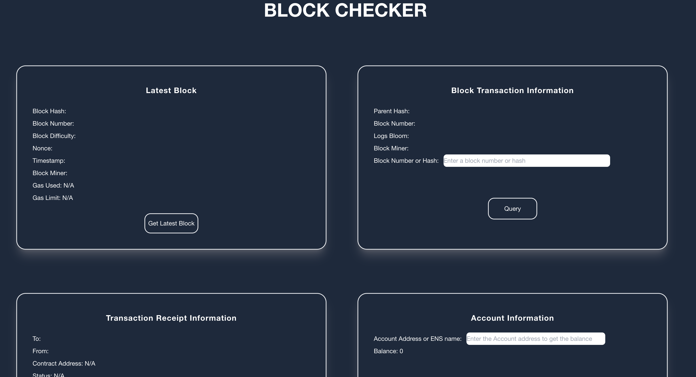

# Simple Block Explorer



This simple tool retrieves information from Ethereum Mainnet based on user input

## Features

- `getBlockInfo()` gets the latest block

- `getBlockTransactionInformation()` gets information for a particular block

- `getTransactionDetail()` gets information for a particular transaction

- `getAccountInformation()` gets the account balance based on an ENS name or account address (PK)

## APIs used -

- getBlock() - 

- getBlockWithTransactions() - 

- getTransactionDetail() - 

- getAccountInformation() - 

## Tech Stack

- React
- Tailwind CSS

## Getting Started

Clone this project to pull down some basic starter code.

After that cd into the base directory of the project and run `npm install` to download all the project dependencies.

## 1. Create a unique Alchemy API key

If you have not already done so, create a unique Alchemy API Mainnet key
for your project as [described here](https://docs.alchemy.com/reference/api-overview?a=eth-bootcamp).

## 2. Add your API key to as an environment variable for the project

Create an empty `.env` file in the base directory of this project.

Add the following line to the `.env` file replacing `YOUR_ALCHEMY_API_KEY` with your api key.

```sh
REACT_APP_ALCHEMY_API_KEY=YOUR_ALCHEMY_API_KEY
```

Do not remove the `REACT_APP_` prefix. React uses that to import env variables.

**⚠️ Note**

> Your Alchemy API Mainnet Key is a sensitive piece of data. If we were\
> building an enterprise app to conquer the world we would never place\
> this sensitive data in the client code of our blockexplorer project that\
> could potentially be read by anyone.
>
> But hey, we're just learning this stuff right now, not conquering anything\
> yet! :-) It won't be the end of the world to put the Alchemy API key in our\
> front-end code for this project.

## 3. Start the webserver

`npm start`

Running the command above will run the app in the development mode. Open [http://localhost:3000](http://localhost:3000) to view it in your browser.

The webpage will automatically reload when you make code changes.

What you'll see in the browser is Ethereum Mainnet's current block number. Not very exciting, but that's where you come in to save the day!

## 3.5 Build instructions

- create production build with - `npm run build` and then you need to :

```zsh
  npm install -g serve
  serve -s build
```

## 4. Make the blockexplorer cooler!

> Feel free to do clone and implement the below ideas

- Connecting the dots.
  - Allow users to click on a block listed in the webpage to get the block's details including its list of transactions
  - From the list of transactions allow users to click on specific transactions to get the details of the transaction
- Make an accounts page where a user can look up their balance or someone else's balance

# Credits

- Thank you  and 
